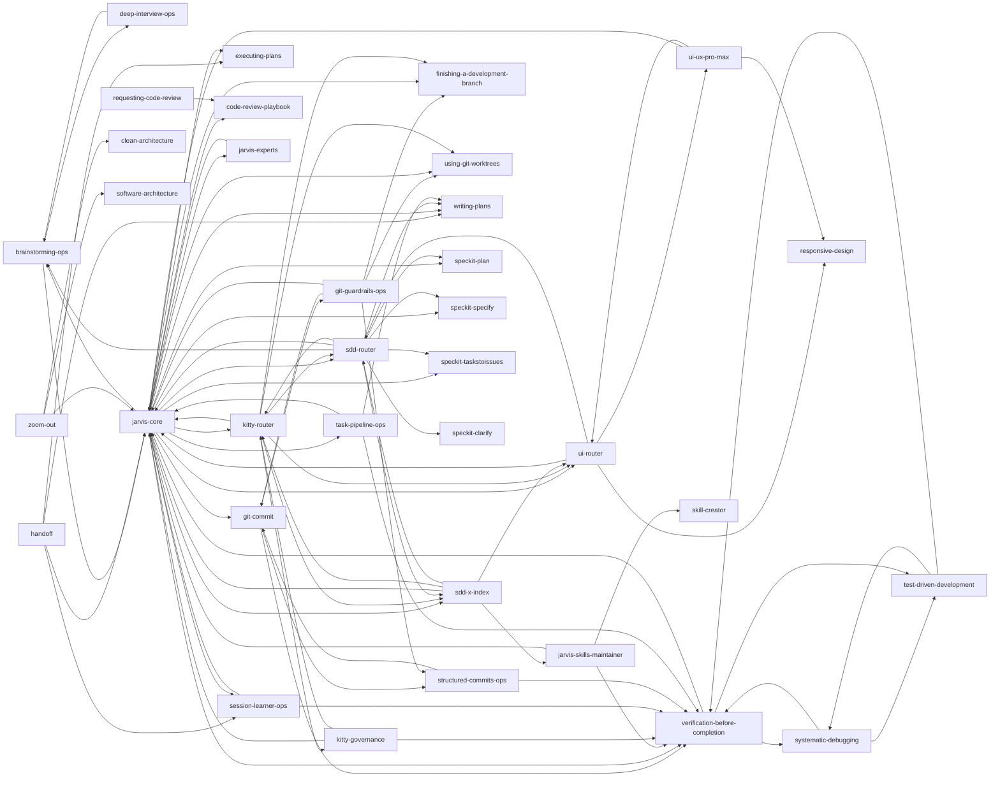

# Grafo de skills relacionadas

> Generado por `scripts/skills-graph.py` — 2026-06-18

```mermaid
flowchart LR
  brainstorming_ops["brainstorming-ops"] --> deep_interview_ops["deep-interview-ops"]
  brainstorming_ops["brainstorming-ops"] --> jarvis_core["jarvis-core"]
  deep_interview_ops["deep-interview-ops"] --> brainstorming_ops["brainstorming-ops"]
  git_commit["git-commit"] --> git_guardrails_ops["git-guardrails-ops"]
  git_commit["git-commit"] --> structured_commits_ops["structured-commits-ops"]
  git_commit["git-commit"] --> verification_before_completion["verification-before-completion"]
  git_guardrails_ops["git-guardrails-ops"] --> finishing_a_development_branch["finishing-a-development-branch"]
  git_guardrails_ops["git-guardrails-ops"] --> git_commit["git-commit"]
  git_guardrails_ops["git-guardrails-ops"] --> jarvis_core["jarvis-core"]
  git_guardrails_ops["git-guardrails-ops"] --> structured_commits_ops["structured-commits-ops"]
  git_guardrails_ops["git-guardrails-ops"] --> using_git_worktrees["using-git-worktrees"]
  handoff["handoff"] --> executing_plans["executing-plans"]
  handoff["handoff"] --> jarvis_core["jarvis-core"]
  handoff["handoff"] --> session_learner_ops["session-learner-ops"]
  handoff["handoff"] --> writing_plans["writing-plans"]
  jarvis_core["jarvis-core"] --> brainstorming_ops["brainstorming-ops"]
  jarvis_core["jarvis-core"] --> code_review_playbook["code-review-playbook"]
  jarvis_core["jarvis-core"] --> executing_plans["executing-plans"]
  jarvis_core["jarvis-core"] --> finishing_a_development_branch["finishing-a-development-branch"]
  jarvis_core["jarvis-core"] --> git_commit["git-commit"]
  jarvis_core["jarvis-core"] --> jarvis_experts["jarvis-experts"]
  jarvis_core["jarvis-core"] --> kitty_router["kitty-router"]
  jarvis_core["jarvis-core"] --> sdd_router["sdd-router"]
  jarvis_core["jarvis-core"] --> sdd_x_index["sdd-x-index"]
  jarvis_core["jarvis-core"] --> session_learner_ops["session-learner-ops"]
  jarvis_core["jarvis-core"] --> speckit_plan["speckit-plan"]
  jarvis_core["jarvis-core"] --> speckit_specify["speckit-specify"]
  jarvis_core["jarvis-core"] --> speckit_taskstoissues["speckit-taskstoissues"]
  jarvis_core["jarvis-core"] --> task_pipeline_ops["task-pipeline-ops"]
  jarvis_core["jarvis-core"] --> ui_router["ui-router"]
  jarvis_core["jarvis-core"] --> using_git_worktrees["using-git-worktrees"]
  jarvis_core["jarvis-core"] --> verification_before_completion["verification-before-completion"]
  jarvis_core["jarvis-core"] --> writing_plans["writing-plans"]
  jarvis_experts["jarvis-experts"] --> jarvis_core["jarvis-core"]
  jarvis_skills_maintainer["jarvis-skills-maintainer"] --> jarvis_core["jarvis-core"]
  jarvis_skills_maintainer["jarvis-skills-maintainer"] --> skill_creator["skill-creator"]
  jarvis_skills_maintainer["jarvis-skills-maintainer"] --> verification_before_completion["verification-before-completion"]
  kitty_governance["kitty-governance"] --> jarvis_core["jarvis-core"]
  kitty_governance["kitty-governance"] --> kitty_router["kitty-router"]
  kitty_governance["kitty-governance"] --> verification_before_completion["verification-before-completion"]
  kitty_router["kitty-router"] --> finishing_a_development_branch["finishing-a-development-branch"]
  kitty_router["kitty-router"] --> jarvis_core["jarvis-core"]
  kitty_router["kitty-router"] --> kitty_governance["kitty-governance"]
  kitty_router["kitty-router"] --> sdd_router["sdd-router"]
  kitty_router["kitty-router"] --> sdd_x_index["sdd-x-index"]
  kitty_router["kitty-router"] --> ui_router["ui-router"]
  kitty_router["kitty-router"] --> using_git_worktrees["using-git-worktrees"]
  requesting_code_review["requesting-code-review"] --> code_review_playbook["code-review-playbook"]
  sdd_router["sdd-router"] --> brainstorming_ops["brainstorming-ops"]
  sdd_router["sdd-router"] --> jarvis_core["jarvis-core"]
  sdd_router["sdd-router"] --> kitty_router["kitty-router"]
  sdd_router["sdd-router"] --> sdd_x_index["sdd-x-index"]
  sdd_router["sdd-router"] --> speckit_clarify["speckit-clarify"]
  sdd_router["sdd-router"] --> speckit_plan["speckit-plan"]
  sdd_router["sdd-router"] --> speckit_specify["speckit-specify"]
  sdd_router["sdd-router"] --> speckit_taskstoissues["speckit-taskstoissues"]
  sdd_router["sdd-router"] --> writing_plans["writing-plans"]
  sdd_x_index["sdd-x-index"] --> jarvis_core["jarvis-core"]
  sdd_x_index["sdd-x-index"] --> jarvis_skills_maintainer["jarvis-skills-maintainer"]
  sdd_x_index["sdd-x-index"] --> kitty_router["kitty-router"]
  sdd_x_index["sdd-x-index"] --> sdd_router["sdd-router"]
  sdd_x_index["sdd-x-index"] --> ui_router["ui-router"]
  session_learner_ops["session-learner-ops"] --> jarvis_core["jarvis-core"]
  session_learner_ops["session-learner-ops"] --> verification_before_completion["verification-before-completion"]
  structured_commits_ops["structured-commits-ops"] --> git_commit["git-commit"]
  structured_commits_ops["structured-commits-ops"] --> verification_before_completion["verification-before-completion"]
  systematic_debugging["systematic-debugging"] --> test_driven_development["test-driven-development"]
  systematic_debugging["systematic-debugging"] --> verification_before_completion["verification-before-completion"]
  task_pipeline_ops["task-pipeline-ops"] --> jarvis_core["jarvis-core"]
  task_pipeline_ops["task-pipeline-ops"] --> verification_before_completion["verification-before-completion"]
  task_pipeline_ops["task-pipeline-ops"] --> writing_plans["writing-plans"]
  test_driven_development["test-driven-development"] --> systematic_debugging["systematic-debugging"]
  test_driven_development["test-driven-development"] --> verification_before_completion["verification-before-completion"]
  ui_router["ui-router"] --> jarvis_core["jarvis-core"]
  ui_router["ui-router"] --> responsive_design["responsive-design"]
  ui_router["ui-router"] --> sdd_router["sdd-router"]
  ui_router["ui-router"] --> ui_ux_pro_max["ui-ux-pro-max"]
  ui_ux_pro_max["ui-ux-pro-max"] --> jarvis_core["jarvis-core"]
  ui_ux_pro_max["ui-ux-pro-max"] --> responsive_design["responsive-design"]
  ui_ux_pro_max["ui-ux-pro-max"] --> ui_router["ui-router"]
  verification_before_completion["verification-before-completion"] --> jarvis_core["jarvis-core"]
  verification_before_completion["verification-before-completion"] --> systematic_debugging["systematic-debugging"]
  verification_before_completion["verification-before-completion"] --> test_driven_development["test-driven-development"]
  zoom_out["zoom-out"] --> clean_architecture["clean-architecture"]
  zoom_out["zoom-out"] --> jarvis_core["jarvis-core"]
  zoom_out["zoom-out"] --> software_architecture["software-architecture"]
```

Nodos conocidos: 62. Aristas (solo a skills en catálogo): 86.
