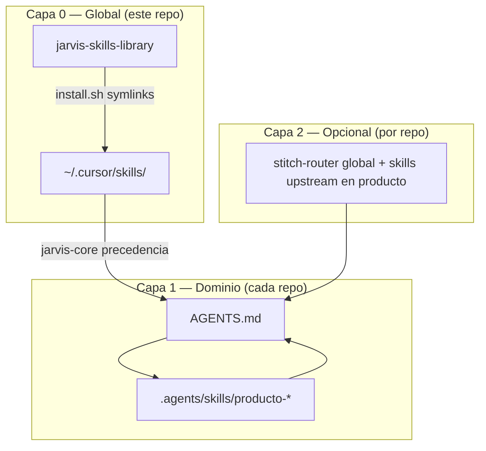

# Arquitectura — capas de skills

## Diagrama

## Flujo de trabajo del desarrollador

1. Clonar/actualizar `jarvis-skills-library`.
2. `bash scripts/install.sh` tras cada pull con skills nuevas.
3. En el repo del producto: solo skills `{producto}-*` o integraciones locales.
4. `AGENTS.md` del producto lista globales por **nombre** (no copia archivos).

## OpenClaw / dual-file

Skills con binarios o runtime OpenClaw pueden incluir:

- `SKILL.md` — documentación completa (Cursor, Claude Code).
- `SKILL-OC.md` — versión compacta (~200 líneas) para OpenClaw.

Convención detallada: [CONVENTIONS.md](CONVENTIONS.md).

## IDE y rutas típicas

| Herramienta | Ruta instalación | Comando install |
|-------------|------------------|-----------------|
| Cursor | `~/.cursor/skills/<name>/` | `scripts/install.sh` |
| Claude Code | `~/.claude/skills/<name>/` | `scripts/install.sh --target ~/.claude/skills` |
| Repo producto (espejo) | `.cursor/skills/` en proyecto | no recomendado para globales |

## SSOT

- **Globales:** este repositorio.
- **Dominio:** repo del producto.
- **Memoria de sesión:** `docs/active_context.md` en cada producto (skill `context-updater`).
