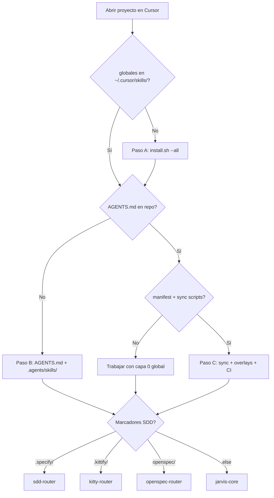

# Onboarding JARVIS — proyectos nuevos o legacy

Guía genérica para adoptar **jarvis-skills-library** en un repo de producto (greenfield o existente sin skills JARVIS). Complementa [MIGRATION.md](MIGRATION.md) (migración legacy en la máquina) y [CORRALX_INTEGRATION.md](CORRALX_INTEGRATION.md) (patrón producto maduro).

Skill operativa: [`project-bootstrap-ops`](../skills/ops/project-bootstrap-ops/SKILL.md).

## Comando `init jarvis`

Frase única para arrancar onboarding en un proyecto:

| Dónde | Qué hacer |
|-------|-----------|
| **Cursor Agent** (repo producto abierto) | Escribir en el chat: **`init jarvis`** |
| **Terminal** (raíz del repo producto) | `bash /path/to/jarvis-skills-library/scripts/init-jarvis.sh` |

El agente invoca `project-bootstrap-ops`: diagnostica Pasos A/B/C, emite plan y pide OK antes de crear archivos. No ejecuta `install.sh` en tu máquina sin permiso explícito.

Opciones terminal: `--min b` (requiere `AGENTS.md` + `.agents/skills/`), `--min c` (+ manifest y scripts sync).

---

| Capa | Dónde vive | Quién instala | Alcance |
|------|------------|---------------|---------|
| **0 — Global** | `jarvis-skills-library` → `~/.cursor/skills/` | Desarrollador en su máquina (`install.sh`) | Todos los proyectos abiertos en Cursor |
| **1 — Producto** | `.agents/skills/` + `AGENTS.md` en el repo | Equipo del producto (commit en git) | Solo ese repo |

Cursor expone **ambas** capas al agente. No hay detección automática al abrir un folder virgen: escribe **`init jarvis`** en el chat o ejecuta `scripts/init-jarvis.sh`.

Ver [ARCHITECTURE.md](ARCHITECTURE.md).

## Cuándo usar cada nivel de bootstrap

| Situación | Mínimo (Paso B) | Completo (Paso C) |
|-----------|-----------------|-------------------|
| Proyecto personal / spike | Paso A + B | Opcional |
| Equipo pequeño, un repo | A + B + Spec Kit opcional | Manifest reducido |
| Producto AIPP (CorralX, Zonix, clawvis) | A + B | **Paso C** — manifest, sync, CI |
| Repo legacy con skills ajenas | A + B + auditoría externas | Migrar manifest gradualmente |

---

## Paso A — Máquina (una vez por desarrollador)

**No ejecutar en `jarvis-skills-library` como si fuera producto.** Solo instala symlinks globales.

```bash
cd /path/to/jarvis-skills-library

bash scripts/validate-all.sh
bash scripts/install.sh --all

readlink -f ~/.cursor/skills/jarvis-core
# Debe terminar en: .../jarvis-skills-library/skills/core/jarvis-core
```

Tras cada `git pull` con skills nuevas o renombradas: repetir `bash scripts/install.sh --all`.

Migración desde `~/jarvis-skills` legacy: [MIGRATION.md](MIGRATION.md).

---

## Paso B — Repo del producto (mínimo viable)

Sin esto el agente **sí** tiene globales en la máquina, pero **no** precedencia de dominio ni índice local.

### Checklist

- [ ] `AGENTS.md` en la raíz del repo
- [ ] `.agents/skills/` con al menos una skill de dominio `{producto}-*` (cuando exista)
- [ ] `docs/active_context.md` (opcional pero recomendado para memoria de sesión)
- [ ] (Opcional Spec Kit) `specify init . --integration cursor-agent` — ver [SDD_SPECKIT_INTEGRATION.md](SDD_SPECKIT_INTEGRATION.md)

### Plantilla mínima — `AGENTS.md`

Plantilla copiable: [`docs/templates/AGENTS.minimal.md`](templates/AGENTS.minimal.md).

Adaptar `{Producto}`, stack y paths. **No copiar** el contenido completo de cada `SKILL.md` global; referenciar por **nombre**.

### Plantilla mínima — skill de dominio

```bash
python3 /path/to/jarvis-skills-library/skills/engineering/skill-creator/scripts/init_skill.py \
  {producto}-api-patterns --path .agents/skills
```

Editar `.agents/skills/{producto}-api-patterns/SKILL.md` con convenciones exclusivas del producto.

---

## Paso C — Patrón producto maduro (equipos)

Copiar y adaptar desde un repo de referencia (CorralX Backend/Frontend, clawvis-openclaw).

| Artefacto | Función |
|-----------|---------|
| `.agents/skills/.global-sync-manifest` | Lista skills globales a espejar; tier `passthrough` o `overlay` |
| `scripts/sync-global-skills-from-library.sh` | Sincroniza desde library (symlink o copia) |
| `scripts/check-global-skills-sync.sh` | Falla si hay drift vs manifest |
| `python3 .agents/skills/sync.sh` | Regenera tablas en `AGENTS.md` + `SKILL_INDEX.md` |
| `MAINTENANCE_SKILLS.md` | Reglas de coherencia para agentes humanos y IA |
| `.github/workflows/global-skills-sync-check.yml` | CI en PRs que toquen `.agents/skills/` |

Referencias:

- CorralX: [CORRALX_INTEGRATION.md](CORRALX_INTEGRATION.md)
- clawvis: [CLAWVIS_INTEGRATION.md](CLAWVIS_INTEGRATION.md)

### Tiers del manifest

| Tier | Comportamiento |
|------|----------------|
| `passthrough` | Copia `SKILL.md` canónico desde library |
| `overlay` | Concatena library + `OVERLAY.md` local → `SKILL.md` destino |

Ejemplo de entrada en `.global-sync-manifest`:

```text
jarvis-core overlay
systematic-debugging passthrough
verification-before-completion passthrough
```

Tras cambio en la library que afecte el manifest: `./scripts/sync-global-skills-from-library.sh` + `./scripts/check-global-skills-sync.sh`.

### Variable `JARVIS_SKILLS_LIBRARY`

Los scripts de sync (CorralX, clawvis) resuelven la ruta canónica así:

```bash
export JARVIS_SKILLS_LIBRARY=/path/to/jarvis-skills-library
./scripts/sync-global-skills-from-library.sh
```

Default si no se exporta: `/var/www/html/proyectos/AIPP/jarvis-skills-library` (adaptar en tu máquina).

Plantilla manifest reducida: [`docs/templates/global-sync-manifest.example`](templates/global-sync-manifest.example).

### Skill Bootstrap opcional (CorralX)

Tras Paso C, productos maduros pueden añadir telemetría y arranque explícito de skills:

| Mecanismo | Función |
|-----------|---------|
| `jarvis-core/OVERLAY.md` | Paso 0: leer `SKILL_INDEX.md` + `jarvis-core`; declarar `> Skills:` en primera respuesta |
| Orquestación agente | **`fan-out-synthesize-ops`** — patrón por defecto: N subagentes paralelos → orquestador sintetiza (tareas no triviales) |
| `SKILL_INDEX.md` | Generado por `python3 .agents/skills/sync.sh` |
| `.cursor/hooks.json` | Telemetría opcional de lecturas de skills |

Detalle CorralX: [CORRALX_INTEGRATION.md](CORRALX_INTEGRATION.md) § Skill Bootstrap y telemetría.

---

## Proyecto legacy con skills ajenas

| Situación | Qué pasa | Acción |
|-----------|----------|--------|
| Skills en `.cursor/skills/` **dentro del repo** | Compiten con globales de máquina | No versionar globales en el repo ([ARCHITECTURE.md](ARCHITECTURE.md)); eliminar o gitignore |
| Symlink legacy `~/jarvis-skills/...` | Globales desactualizadas | [MIGRATION.md](MIGRATION.md) + `install.sh --all` |
| Skills de terceros en `.agents/skills/` | Conviven; no se reemplazan solas | `claude-skills-router` + `skill-security-auditor`; decidir qué conservar |
| Sin `AGENTS.md` | Precedencia improvisada | Crear plantilla Paso B |
| Globales no instaladas | Agente ve skills viejas o ausentes | Paso A |
| Solo globales, sin manifest | Funciona para desarrollo individual | Paso C cuando haya equipo o overlays |

El agente **no** borra skills ajenas ni ejecuta `install.sh` sin orden explícita del usuario.

---

## Detección de flujo SDD (automática parcial)

Los routers inspeccionan marcadores en disco del **repo activo**:

| Marcador | Router | Doc |
|----------|--------|-----|
| `.kittify/` | `kitty-router` | [SPEC_KITTY_INTEGRATION.md](SPEC_KITTY_INTEGRATION.md) |
| `openspec/` | `openspec-router` | [AWESOME_SPEC_KITS.md](AWESOME_SPEC_KITS.md) |
| `.specify/` | `sdd-router` → `speckit-*` | [SDD_SPECKIT_INTEGRATION.md](SDD_SPECKIT_INTEGRATION.md) |
| `.agents/plans/` o ninguno | `jarvis-core` → `writing-plans` | — |

Bootstrap Spec Kit en producto:

```bash
uv tool install specify-cli --from git+https://github.com/github/spec-kit.git@v0.11.2
cd /path/to/product-repo
specify init . --integration cursor-agent --integration-options="--skills" --force
```

---

## Diagrama de decisión



---

## Comandos de diagnóstico rápido

Ejecutar desde la **raíz del repo de producto** (no desde jarvis-skills-library):

```bash
# Script canónico (recomendado)
bash /path/to/jarvis-skills-library/scripts/check-project-bootstrap.sh
bash /path/to/jarvis-skills-library/scripts/check-project-bootstrap.sh --min b
bash /path/to/jarvis-skills-library/scripts/check-project-bootstrap.sh --min c
```

Salidas clave: `GLOBAL_STATE=OK|LEGACY|MISSING`, `WARN_REPO_GLOBAL_SKILLS`, `JARVIS_SKILLS_LIBRARY=...`.

Checks manuales equivalentes:

```bash
test -L ~/.cursor/skills/jarvis-core && readlink -f ~/.cursor/skills/jarvis-core
test -f AGENTS.md && echo OK_AGENTS || echo MISSING_AGENTS
test -d .cursor/skills && echo WARN_REPO_GLOBAL_SKILLS
```

Invocar skill `project-bootstrap-ops` para un informe estructurado y plan accionable.

---

## Qué NO hacer

- Copiar las ~100 skills globales al repo del producto (usar manifest + sync o solo `~/.cursor/skills/`).
- Ejecutar `specify init` dentro de `jarvis-skills-library`.
- Asumir que Cursor instala globales al clonar el producto.
- Reemplazar skills de terceros sin auditoría y OK del equipo.

---

## Referencias cruzadas

| Doc | Uso |
|-----|-----|
| [ARCHITECTURE.md](ARCHITECTURE.md) | Capas 0 / 1 / 2 |
| [MIGRATION.md](MIGRATION.md) | Legacy `~/jarvis-skills` → library |
| [SDD_SPECKIT_INTEGRATION.md](SDD_SPECKIT_INTEGRATION.md) | Spec Kit bootstrap |
| [CORRALX_INTEGRATION.md](CORRALX_INTEGRATION.md) | Patrón manifest CorralX |
| [CLAWVIS_INTEGRATION.md](CLAWVIS_INTEGRATION.md) | Patrón OpenClaw |
| [`docs/templates/AGENTS.minimal.md`](templates/AGENTS.minimal.md) | Plantilla AGENTS.md |
| [`docs/templates/global-sync-manifest.example`](templates/global-sync-manifest.example) | Plantilla manifest Paso C |
