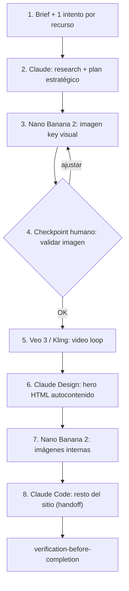

# AI Media Landing Ops

Metodología para construir **landings premium con media generativa** encadenando varias herramientas de IA. El valor no está en las herramientas concretas sino en el **orden, la disciplina de prompting y los checkpoints humanos**.

Ejemplo trabajado completo (caso NEONFALL): [references/neonfall-walkthrough.md](references/neonfall-walkthrough.md).

Complementa:
- `ui-router` — UI en código del producto (Flutter/Blade). Esta skill genera **assets + draft HTML**, no toca `lib/`.
- `open-design-router` — artefacto standalone vía un daemon único. Esta skill es **cadena multi-tool** con video hero.
- `stitch-router` — Google Stitch (MCP). Esta skill usa **Claude Design + media gen**, no Stitch.

## Cuándo usar

- Landing/hero con **video en loop** o personaje animado generado por IA.
- Sitio que necesita imágenes IA consistentes (key visual + escenas internas).
- Handoff de un draft visual a código (Claude Design → Claude Code).

## Pipeline (8 pasos)



## Herramientas (rol en la cadena)

| Paso | Herramienta | Rol | Alternativa / nota |
|------|-------------|-----|--------------------|
| Research + prompts | Claude (claude.ai) | Orquestador: investiga y **genera los prompts** de las demás tools | — |
| Imagen | Nano Banana 2 (Gemini 3.x Flash Image, Google AI Studio) | Key visual + escenas internas, 16:9 4K, buen negative space | Otros image models |
| Video loop | Veo 3 (Google AI Studio) o Kling 3.0 | Hero animado en loop | Kling permite start+end frame; Veo no |
| Hero draft | Claude Design | Primer borrador del hero (HTML autocontenido) | — |
| Resto del sitio | Claude Code | Completa secciones preservando design tokens | — |
| Loop post | Kapwing u otra | Crossfade del corte si el loop no cierra | — |

**Plan free = 1 intento por recurso.** Por eso cada prompt debe ser "a prueba de errores": de ahí la disciplina de abajo.

## Flujo recomendado

1. **Brief a Claude** — declarar single-shot, output final, adjuntar referencias (plantilla en [neonfall-walkthrough.md](references/neonfall-walkthrough.md) § paso 1).
2. **Research + prompts** — Claude investiga y escribe los prompts de cada tool antes de generar.
3. **Imagen key visual** — Nano Banana 2 (16:9 4K); **checkpoint humano** antes de continuar.
4. **Video loop** — Kling (start=end frame) o Veo 3 (timestamp-prompting); **checkpoint humano**.
5. **Hero HTML** — Claude Design (autocontenido, dual-video, design tokens); validar en browser.
6. **Imágenes internas** — Nano Banana 2 (2 escenas, mismo ADN visual).
7. **Resto del sitio** — Claude Code (handoff preservando tokens; plantilla § paso 8).
8. **`verification-before-completion`** — loop, consola, responsive, assets en rutas correctas.

## Convención de assets

Fijar nombres **antes** del handoff a Claude Code:

| Archivo | Uso |
|---------|-----|
| `/assets/hero-loop.mp4` | Video hero (loop) |
| `/assets/section-epic.webp` | Sección amplia / paisaje |
| `/assets/section-intimate.webp` | Sección íntima / atmósfera |

Mantener rutas estables entre Claude Design y Claude Code; no renombrar a mitad del pipeline.

## Patrones de prompting (lo reutilizable)

### 1. Single-shot discipline
En el primer mensaje a Claude declarar explícitamente: **(a)** hay un solo intento por recurso, **(b)** cuál es el output final esperado, **(c)** que NO se busca velocidad sino calidad. Esto cambia drásticamente cómo responde el modelo (investiga, valida, no improvisa).

### 2. Negative space deliberado
Para que el hero tenga lugar para tipografía: sujeto al **tercio** del frame, el resto **limpio**. Repetir la restricción en `Constraints` ("do not center", "left side completely clean") porque los modelos tienden a centrar. Definir lente, ángulo, encuadre y altura de cámara reduce la varianza.

### 3. Loop perfecto
- **Kling:** subir la **misma imagen** como Start Frame Y End Frame → loop matemáticamente perfecto.
- **Veo 3 (sin end frame):** forzarlo con **timestamp-prompting** (`[00:00–00:01] …`, último bloque = "return to exact start frame"), **cámara estática** ("locked-off, no pan/zoom/tilt/dolly"), y movimiento mínimo de una sola parte. El trigger `(that's where the camera is)` mejora la adherencia.
- **Plan B obligatorio:** crossfade de 0.3–0.7 s entre fin e inicio (Kapwing) o dual-video en el HTML (abajo).

### 4. Dual-video crossfade (hero HTML)

Skeleton HTML (iOS requiere `autoplay muted loop playsinline`):

```html
<div class="hero-video-wrap" style="position:absolute;inset:0;overflow:hidden;">
  <video id="video-a" autoplay muted loop playsinline
    style="position:absolute;inset:0;width:100%;height:100%;object-fit:cover;opacity:1;transition:opacity 0.7s;"></video>
  <video id="video-b" autoplay muted loop playsinline
    style="position:absolute;inset:0;width:100%;height:100%;object-fit:cover;opacity:0;transition:opacity 0.7s;"></video>
</div>
```

Dos `<video>` superpuestos que se intercambian para que el corte del loop sea invisible:

```js
const VIDEO_URL = "/assets/hero-loop.mp4";
const CROSSFADE_MS = 700;
const TRIGGER_BEFORE_END = 0.7; // s antes del final
const a = document.getElementById('video-a');
const b = document.getElementById('video-b');
[a, b].forEach(v => { v.src = VIDEO_URL; v.load(); });
let active = a, standby = b;
active.play();
(function tick(){
  if (active.duration) {
    const remaining = active.duration - active.currentTime;
    if (remaining <= TRIGGER_BEFORE_END && standby.paused) {
      standby.currentTime = 0; standby.play();
      standby.style.opacity = '1'; active.style.opacity = '0';
      setTimeout(() => { const t = active; active = standby; standby = t; standby.pause(); }, CROSSFADE_MS);
    }
  }
  requestAnimationFrame(tick);
})();
```

### 5. ADN visual consistente
Todos los assets (hero, imágenes internas) comparten **paleta + estética ancla** (ej. magenta-púrpura-cyan, anime-cyberpunk). Una imagen ÉPICA/amplia y otra ÍNTIMA/atmosférica dan ritmo sin sentirse repetitivo.

### 6. Handoff Claude Design → Claude Code
El hero se pide como **HTML autocontenido** (Tailwind CDN, vanilla JS, cero build). Al pasar a Claude Code: **reutilizar los design tokens** existentes (variables CSS, fuentes), no duplicarlos; pasar screenshot del hero + imágenes; especificar secciones, orden y reglas (no `<form>`, no storage, `loading="lazy"`, smooth scroll).

## Checkpoints humanos (HITL)

Validar cada asset **antes** de gastar el siguiente intento (la imagen antes del video, el video antes del hero). Ver `human-in-the-loop-ops`. No encadenar a ciegas: cada checkpoint es una oportunidad de corregir barato.

| Asset | Pass | Fail → acción |
|-------|------|---------------|
| Imagen | Sujeto en tercio correcto, negative space limpio, pose estable | Re-prompt imagen (no gastar video) |
| Video | Loop cierra o crossfade aceptable, cámara estática | Kapwing crossfade o dual-video en HTML |
| Hero HTML | Tokens en `:root`, loop visible, mobile legible | Ajustar en Claude Design antes de Code |

## Puente post-pipeline

Si el destino final es **Flutter/Blade en el producto** (`lib/`, vistas Blade), el HTML de Claude Design/Code es **referencia visual**, no código de producción. Portar layout, copy y paleta vía **`ui-router`** + tokens de marca del producto (`corralx-ui-design`, `zonix-web-design`, etc.). No copiar Tailwind CDN ni variables genéricas del draft a producción.

## Gates JARVIS

- **No delegar todo en un prompt único** ("creame la web completa"): produce mala calidad. Respetar el paso a paso.
- **No inventar** resultados de tools que no se ejecutaron; el usuario corre cada generación y pega el asset.
- `verification-before-completion` antes de declarar la landing lista (abrir el HTML, revisar loop, consola sin errores).
- Implementación en producto (Flutter/Blade) → `ui-router`; no copiar HTML del draft a ciegas.
- Publicación → `publish-safety` si aplica.

## Cuándo NO usar

| Caso | Skill correcta |
|------|----------------|
| UI/componente en `lib/` del producto (Flutter/Blade) | `ui-router` → `{producto}-ui-design` |
| Carrusel/deck/email standalone (un daemon) | `open-design-router` |
| Prototipo en plataforma Google Stitch (MCP) | `stitch-router` |
| Solo tokens/paleta para código | `ui-ux-pro-max` |
| Backend/API sin UI | — |

## Crédito

Proceso destilado del caso **NEONFALL** por Juan Pablo Rosso · Nexum AI (nexumai.online). Ver [references/neonfall-walkthrough.md](references/neonfall-walkthrough.md).
